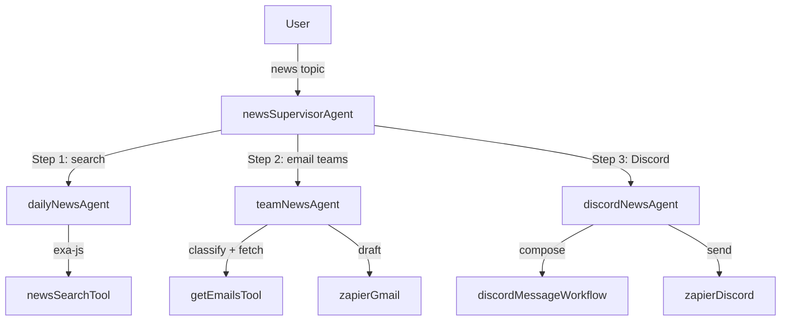

# MastraVentures Daily News Reporter

## Background

You are the Head of AI at **MastraVentures**, a venture capital firm with five active investment teams: Climate, Fintech, Consumer, Enterprise, and Health. You're here to be the expert on AI current events and passing on important information to your teammates and community. Every morning your team needs to know what happened overnight — which startups raised, which markets moved, and whether MastraVentures itself is in the news. It's important to keep your community in the know as well.

You built this system to handle all of that automatically. Give it a topic, and it will search for the latest articles, brief every relevant internal team with a Gmail draft, and post any Mastra-related coverage directly to your team's Discord. No copy-pasting, no manual routing, no forgotten follow-ups.

The system is built on [Mastra](https://mastra.ai) — a TypeScript framework for building AI agents and workflows.

---

## Architecture

A **News Supervisor Agent** acts as the coordinator. You interact with it through [Mastra Studio](http://localhost:4111) and it delegates all real work to three specialised subagents, running them in sequence on every news request.



---

## Setup

### Prerequisites

- Node.js 22.13.0+ and npm
- An [OpenAI](https://platform.openai.com) account with API access
- An [Exa](https://exa.ai) account with API credits
- A [Zapier](https://zapier.com) account with Gmail and Discord connected

### 1. Install dependencies

```bash
npm install
```

### 2. Configure environment variables

Copy the example file and fill in your keys:

```bash
cp .env.example .env
```

Open `.env` and set the following three values:

```env
OPENAI_API_KEY=        # Your OpenAI API key
EXA_API_KEY=           # Your Exa API key
ZAPIER_MCP_URL=        # Your Zapier MCP endpoint URL
```

### 3. Get an Exa API key

1. Sign up at [exa.ai](https://exa.ai)
2. Add credits to your account (a small amount is enough for development)
3. Copy your API key from the dashboard into `.env` as `EXA_API_KEY`

### 4. Set up Zapier (Gmail + Discord)

The system uses Zapier's MCP integration to draft Gmail emails and send Discord messages. No custom webhooks needed.

1. Create a free account at [zapier.com](https://zapier.com)
2. Connect your **Gmail** account to Zapier
3. Connect your **Discord** account to Zapier and grant access to the target server
4. In Zapier, navigate to the **MCP** section and enable it
5. Copy the generated MCP endpoint URL into `.env` as `ZAPIER_MCP_URL`

### 5. Start Mastra Studio

```bash
npm run dev
```

Studio opens at [http://localhost:4111](http://localhost:4111). Select **News Supervisor Agent** from the Agents panel and start chatting.

---

## Appendix

### Agents

#### News Supervisor Agent

**File:** `src/mastra/agents/news-supervisor-agent.ts`

The entry point and coordinator. It never searches, drafts, or posts anything itself — it only delegates.

On your first message it will ask for your name and store it in working memory. Your name is used to sign all outgoing team emails and is remembered across sessions. After that, any message that isn't a direct question is treated as a news request and triggers the full three-step workflow below.

#### Daily News Agent

**File:** `src/mastra/agents/daily-news-agent.ts`

Handles Step 1: finding the news. Given a topic, it calls the `newsSearch` tool (powered by exa-js) to retrieve up to five articles published in the last 24 hours, then returns a structured list of titles, URLs, publish dates, and brief summaries.

The `recencyScorer` is attached to this agent and runs on every response, continuously tracking how fresh the returned articles are.

#### Team News Agent

**File:** `src/mastra/agents/team-news-agent.ts`

Handles Step 2: briefing the right internal teams. It receives the article list and:

1. Classifies the topic against MastraVentures' five investment focus areas:
   - **Climate** — clean energy, climate tech, carbon markets, ESG
   - **Fintech** — payments, banking, crypto, financial infrastructure
   - **Consumer** — consumer brands, e-commerce, retail, social commerce
   - **Enterprise** — B2B software, SaaS, developer tools, cloud infrastructure
   - **Health** — digital health, biotech, medtech, healthcare AI, drug discovery
2. Calls `getEmails` to retrieve the email addresses for each matching team from `emailList.json`
3. Creates a separate Gmail draft for each matching team via Zapier — one draft per team, signed with your name

Drafts are never sent automatically. They land in your Gmail Drafts folder for review.

#### Discord News Agent

**File:** `src/mastra/agents/discord-news-agent.ts`

Handles Step 3: Discord alerting. It checks only the top article from the list. If that article mentions "Mastra" in the title or summary, it composes a formatted message and posts it to the `#mastra-news` channel via Zapier. If the top article does not mention Mastra, it stops immediately without posting anything.

---

### Data Files

#### Email List

**File:** `src/emailList.json`

The firm's internal email directory, keyed by investment area (`climate`, `fintech`, `consumer`, `enterprise`, `health`). Update this file with real team email addresses before going to production.

---

### Evaluation

The system includes a built-in evaluation pipeline to measure how well the Daily News Agent is performing over time.

#### Recency Scorer

**File:** `src/mastra/scorers/news-scorer.ts`

An LLM judge that evaluates how fresh the articles in an agent response are. Scores each article individually, then averages:

| Age of article | Score |
|---|---|
| Within 24 hours | 1.0 |
| Within 48 hours | 0.5 |
| Within 72 hours | 0.25 |
| Older than 72 hours | 0.0 |
| Live / continuously updated | 1.0 |

#### Dataset

**File:** `src/mastra/datasets/recency-dataset.ts`

Seeds the `news-recency` dataset with five test queries. Run once:

```bash
npx tsx src/mastra/datasets/recency-dataset.ts
```

#### Experiment Script

**File:** `src/mastra/scripts/news-recency-experiment-script.ts`

Runs the dataset through the Daily News Agent + Recency Scorer and prints color-coded results (green = fresh, yellow = mixed, red = stale):

```bash
npx tsx src/mastra/scripts/news-recency-experiment-script.ts
```

---

### Project Structure

```
src/
  emailList.json                  # Internal team email directory
  mastra/
    agents/
      news-supervisor-agent.ts    # Coordinator — delegates to all three subagents
      daily-news-agent.ts         # Searches for news via Exa
      team-news-agent.ts          # Classifies topics and drafts Gmail emails
      discord-news-agent.ts       # Checks for Mastra mentions and posts to Discord
    tools/
      news-search-tool.ts         # Exa-powered news search
      get-emails-tool.ts          # Reads emailList.json by category
    workflows/
      discord-message-workflow.ts # Composes and formats Discord messages
    scorers/
      news-scorer.ts              # Recency scorer for the Daily News Agent
    datasets/
      recency-dataset.ts          # Seeds the news-recency evaluation dataset
    scripts/
      news-recency-experiment-script.ts  # Runs and prints experiment results
    mcp/
      zapier-client.ts            # Shared Zapier MCPClient instance
    schema/
      userSchema.ts               # Working memory schema (stores user name)
    index.ts                      # Mastra instance configuration
```
